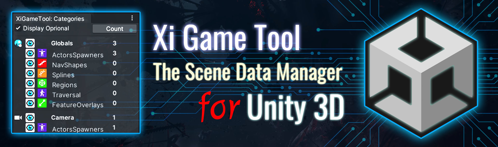

# XiGameTool _The game data tool for Unity 3D_


[](https://github.com/hww/XiGameTool/actions/workflows/ci.yml)
[](https://openupm.com/packages/com.hww.xigametool/)
[](https://github.com/hww/XiGameTool/blob/master/LICENSE)
[](https://github.com/semantic-release/semantic-release)



Simple Unity editor extension for managing visibility of layers and categories of objects, created by [hww](https://github.com/hww)

## Introduction

The scene editor in Unity 3D has enough features to work with small scenes. But when I need to edit scenes with lots of play zones, I sometimes miss the control system for selective categories, layers or sets. This very simple plugin lets you add three additional panels to the level editor. The tool controls the visibility and color for any debug information rendering such as _gizmos_, _splines_, _colliders_ etc.  The layers managing tool has simple for layer locking

- **Visibility and color management of Unity layers** _For managing the primitives related on Unity Layers_.
- **Manage the visibility of object categories** _For managing scene data by gtoups (_camera_, _gameplay_, _battle_ etc) and by categories (_spawner_, _traversal_, _splines_ etc)_.
- **Manage the visibility of object set** _For managing the objects sets such as _scrpable, _target pointes_, etc_.

It is easy to modify tool to have your custom lists of _levels_, _categories_, _sets_.

In addition to management, the panels display the object's statistics. As a result of the results of the use of this extension has shown high efficiency on large commercial projects.

## Install

The package is available on the openupm registry. You can install it via openupm-cli.

```bash
openupm add com.hww.xigametool
```
You can also install via git url by adding this entry in your manifest.json

```bash
"com.hww.xigametool": "https://github.com/hww/XiGameTool.git#upm"
```
## TODO

- [x] Basic functionality
- [x] Configurabe and safe (no enum) the objects tagging
- [ ] The performance optimization
- [ ] Update documentation
- [ ] Better redraw screen for Unity

## GamePrimitive Class

The example of ArtPrimitive class below. This class associate the game object with one of art groups and categories.

```C#
public class GamePrimitive : MonoBehaviour
{
    public string subcategoryName;            // Select the art group of this object
    public string selectionSetName;           // Select the art category of this object
    
    public Subcategory Subcategory => ...     // Get the game-type in this category
    public SelectionSet SelectionSet => ...   // Get selection-set for this primitive
    public GameLayer Layer => ...             // Get the layer of this primitive
}
``` 
 


## Game Categories Window

To control categories and subcategories of the objects.


## Unity Layers Visibility and Color

The pannel alow makes visible or invisible the Unity layers, also it can set a layer protected or not. Additionaly it allow to change layer's color. And finaly it displays metrics per layer.


## Game Obect Sets Visibility and Color

The pannel alow makes visible or invisible the objet set. Additionaly it displays metrics per category.


## Example of using

```C#
void OnDrawGizmos()
{
    if (SelectionSet.IsVisible && Subcategory.IsVisible)
    {
        Gizmos.color = SelectionSet.Color;
        Gizmos.DrawWireSphere(transform.position, 1f);
        UnityEditor.Handles.Label(transform.position, gameObject.name);
    }
}
```

The line and fill colors will be used from SelectionSet or from Layers panel. For a physical colliders (example below) the color will be.

```C#
BoxCollider _boxCollider;
BoxCollider BoxCollider => _boxCollider ??= GetComponent<BoxCollider>();

void OnDrawGizmos()
{
    if (SelectionSet.IsVisible && Subcategory.IsVisible)
    {
        Gizmos.color = GameTool.Layers.GetColor(gameObject.layer);
        Gizmos.DrawWireCube(transform.position, BoxCollider.size);
        UnityEditor.Handles.Label(transform.position, gameObject.name);
        Gizmos.DrawIcon(transform.position, "your gizmo icon");
    }
}
```

## The Settings

There is GameToolSettings asset with configuation of the tool (see below).


With this tool is possible to configure:

- Game Object Types 
- Game Categories and Subcategories
- The selection sets

Alternatively, it is possible to place GameToolSettingsBehaviour on the Scene and point to one of other GameToolSettings assets. This is the way to have configuration per scene.
